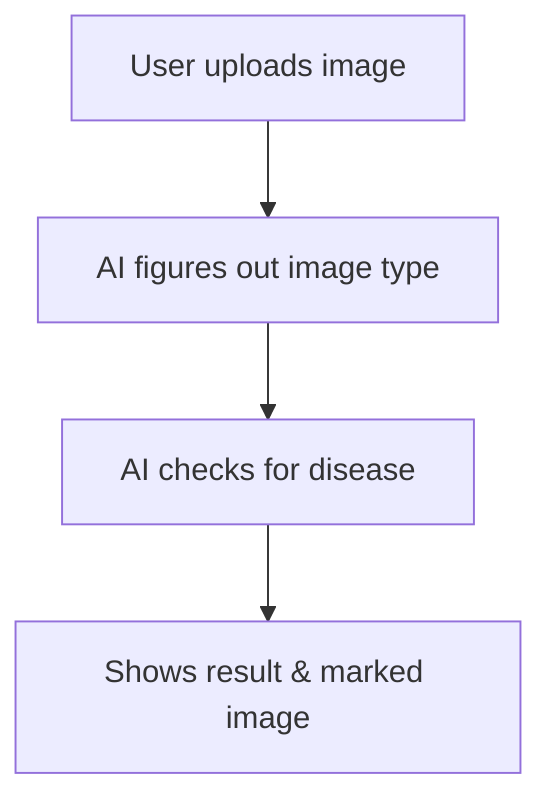

# Disease Models: Non-Technical Overview

## What is This Project?
This project is an AI-powered web application that helps analyze medical images (like X-rays and brain scans) to detect certain diseases. It is designed to make advanced medical image analysis accessible to everyone—patients, doctors, business leaders, and investors—without needing any technical background.

---

## Key Benefits
- **Fast & Automated:** Get instant analysis of medical images—no waiting for manual review.
- **Accessible:** Easy-to-use web interface; no coding or technical skills required.
- **Versatile:** Supports multiple disease types (Alzheimer's, bone fractures, spine issues, brain tumors, pneumonia).
- **Scalable:** Can be extended to support more diseases and image types.
- **Demonstrates AI Potential:** Showcases how artificial intelligence can assist in healthcare and diagnostics.

---

## How Does It Work? (Simple Workflow)
1. **Upload:** User uploads a medical image (e.g., X-ray, MRI scan) via the web app.
2. **AI Analysis:** The app uses advanced AI models to:
   - Identify what kind of image it is (brain scan, chest X-ray, etc.).
   - Analyze the image for signs of disease.
3. **Results:** The app displays the processed image and a clear, easy-to-understand diagnosis.

---

## Simple Architecture Diagram

---

## What Data & Models Are Used?
- **Data:**
  - Medical images (X-rays, MRIs) uploaded by users.
  - Example/reference images for each disease type.
- **AI Models:**
  - **Image Type Detector:** Recognizes what kind of medical image is uploaded.
  - **Disease Detectors:** Specialized models for each disease (e.g., Alzheimer's, fractures, pneumonia).

---

## Who Can Use This?
- **Patients & Families:** Get a quick, AI-powered second opinion (for educational/demo purposes).
- **Doctors & Clinics:** See how AI can assist in diagnostics.
- **Business Leaders & Investors:** Understand the potential of AI in healthcare.
- **Researchers & Students:** Explore AI applications in medicine.

---

## How to Use It
1. Open the web app in your browser.
2. Click to upload a medical image.
3. Wait a few seconds for the AI to analyze it.
4. View the results and download the processed image if needed.

---

## Business & Social Impact
- **Improves Access:** Makes expert-level analysis available anywhere, anytime.
- **Saves Time:** Reduces the burden on medical professionals.
- **Supports Decision-Making:** Helps users make informed choices about their health.
- **Demonstrates Innovation:** Shows how AI can transform healthcare.

---

## Limitations & Disclaimer
- **Not for Clinical Use:** This tool is for demonstration and educational purposes only. It is not a substitute for professional medical advice or diagnosis.
- **Model Accuracy:** Results depend on the quality of the uploaded image and the AI models used.

---

## Contact & More Information
For more details, technical documentation, or partnership inquiries, please contact the project team.

---

*This overview is designed for everyone—no technical background required!* 