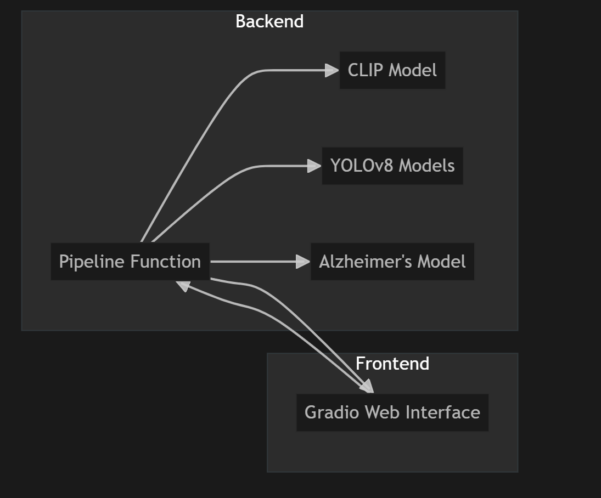

# Disease Models: Medical Image Diagnosis App

Welcome! This project is a simple tool that helps you analyze medical images (like X-rays or brain scans) to detect certain diseases using artificial intelligence (AI).

## What does this app do?
- You upload a medical image (like an X-ray or MRI scan).
- The app uses AI to figure out what kind of image it is (for example, a brain scan or a chest X-ray).
- It then uses a special AI model to check for diseases in that image, such as Alzheimer's, bone fractures, spine issues, brain tumors, pneumonia, or hair-related conditions.
- The app shows you the processed image and a diagnosis result.

## How does it work?
1. **Image Type Detection:**
   - The app first checks what kind of medical image you uploaded using a smart AI model called CLIP.
2. **Disease Detection:**
   - If it’s a brain scan, it checks for Alzheimer’s disease and tells you the stage (like Mild, Moderate, etc.).
   - If it’s an X-ray (bone, spine, chest, etc.), or a hair-related image, it uses another AI model to find things like fractures, tumors, pneumonia, or hair conditions.
3. **Results:**
   - You get a marked-up image and a simple text result explaining what was found.

## What models does it use?
- **CLIP Model:** Figures out what kind of image you uploaded.
- **Alzheimer’s Model:** Checks brain scans for signs of Alzheimer’s disease.
- **YOLOv8 Models:** Looks for problems in X-rays (like fractures, tumors, pneumonia) and now also supports hair-related image analysis.

## What images can I use?
- Brain scans (for Alzheimer’s)
- X-rays of bones, spine, chest (for fractures, tumors, pneumonia)
- Hair/scalp images (for hair-related analysis)

## How do I use it?
1. Open the app (it runs in your web browser).
2. Click to upload your medical image.
3. Wait a few seconds for the AI to analyze it.
4. See the results and the processed image.

---

## Workflow Overview

---

## Project Files & What They Do

| File/Folder         | What it’s for (in simple terms)                                         |
|--------------------|--------------------------------------------------------------------------|
| app.py             | The main app: runs the AI, handles images, and shows the web interface.  |
| try_model.py       | Lets you test a model on a sample image from the command line.           |
| try_api.py         | Lets you test the app’s API (for developers or advanced users).          |
| requirements.txt   | Lists the software needed to run the app.                                |
| images/            | Example/reference images for each disease or condition.                  |
| testing_images/    | Extra images for testing the models (not used by the main app directly). |
| alzheimers.h5      | The AI model for Alzheimer’s detection.                                  |
| bone.pt            | The AI model for bone fracture detection.                                |
| spine.pt           | The AI model for spine issue detection.                                  |
| brain_tumor.pt     | The AI model for brain tumor detection.                                  |
| Pneumonia.pt       | The AI model for pneumonia detection.                                    |
| Hair.pt            | The AI model for hair/scalp condition detection.                        |
| train_model_yolo.ipynb | Notebook for training new YOLO models (for developers/advanced users).|
| train_model_tensorflow.ipynb | Notebook for training new TensorFlow models (for developers/advanced users).|
| README.md          | This file! Explains the project for everyone.                            |
| NON_TECH_OVERVIEW.md| A more detailed, business-friendly overview.                            |
| TECHNICAL_DETAILS.md| Technical details for developers and students.                          |

---

## What does each part of the main app (app.py) do?

- **Imports & Setup:** Loads all the tools and AI models needed for the app to work.
- **Image Type Detection (CLIP):** Figures out what kind of image you uploaded (brain, bone, hair, etc.).
- **Alzheimer’s Model:** If it’s a brain scan, checks for Alzheimer’s and tells you the stage.
- **YOLOv8 Models:** If it’s an X-ray or hair image, checks for fractures, tumors, pneumonia, or hair conditions.
- **Pipeline:** The main logic that decides which model to use and puts everything together.
- **Web Interface (Gradio):** The part you see in your browser—lets you upload images and see results.

---

## New Features & Models
- **Hair Model:** The app now supports hair/scalp image analysis using the new Hair.pt model and reference images.
- **New Scripts:**
  - `try_model.py`: Lets you test a model on a sample image without using the web app.
  - `try_api.py`: Lets you test the app’s API directly (for advanced users or developers).
- **Training Notebooks:**
  - `train_model_yolo.ipynb`: For training new YOLO models (object detection, e.g., for new diseases or conditions).
  - `train_model_tensorflow.ipynb`: For training new TensorFlow models (e.g., for Alzheimer’s or other classification tasks).
  - *These are for developers or researchers who want to customize or improve the AI models. You don’t need them to use the app!*

---

## Who is this for?
- Anyone curious about AI in medical imaging.
- Not for real medical diagnosis—just for learning and demonstration!

---

For more details or technical info, see the advanced documentation file (TECHNICAL_DETAILS.md).
