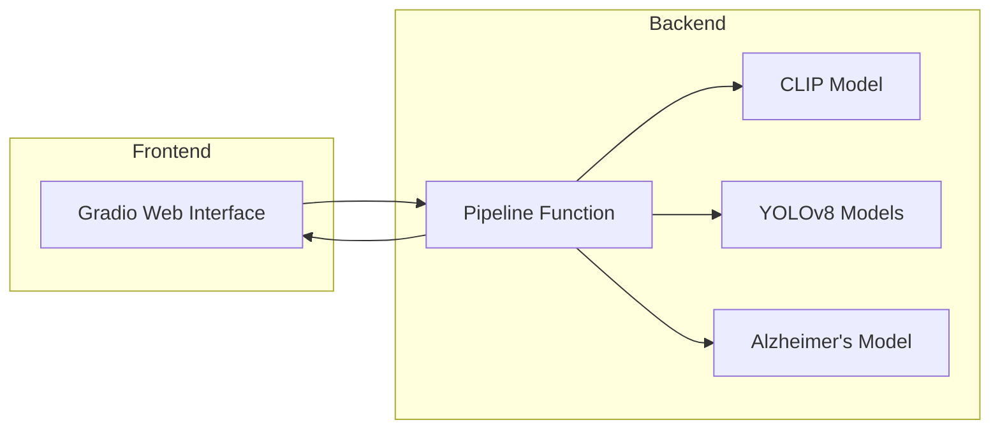

# Disease Models: Technical Documentation

## Diagrams

### 1. Workflow Overview

```mermaid
flowchart TD
    A[User uploads medical image] --> B[CLIP Model: Image Type Detection]
    B -->|Brain scan| C[Alzheimer's Model (Keras): Stage Classification]
    B -->|X-ray (bone, spine, chest)| D[YOLOv8 Model: Object Detection]
    C --> E[Processed Image + Diagnosis]
    D --> E[Processed Image + Diagnosis]
    E --> F[Results shown in Gradio Web UI]
```

### 2. System Architecture



### 3. Data Flow

```mermaid
flowchart LR
    A[Input Image] --> B[Save Temp File]
    B --> C[Get Embedding (CLIP)]
    C --> D[Cosine Similarity with Reference Embeddings]
    D --> E{Best Match}
    E -->|Alzheimer's| F[Preprocess & Predict (Keras)]
    E -->|Other| G[YOLOv8 Detection]
    F --> H[Diagnosis String]
    G --> H
    H --> I[Return Image + Diagnosis]
```

---

## Usage Examples

### Example 1: Running the App Locally
```bash
pip install -r requirements.txt
python app.py
```
Open the provided local URL in your browser, upload a medical image, and view the results.

### Example 2: Example Input and Output
- **Input:** Upload a brain MRI image.
- **Output:**
  - Processed image with overlays (if applicable).
  - Diagnosis text, e.g., "🧠 Alzheimer Stage: Mild Demented (Confidence: 0.87)".

### Example 3: Adding a New Model
1. Add a new reference image to `images/`.
2. Train and add a new YOLO or Keras model file.
3. Update the `KNOWN_IMAGES` and `YOLO_MODELS` dictionaries in `app.py`.

---

## API Details

### Main Functions in `app.py`

#### `load_models()`
- Loads and caches the CLIP model and processor from Hugging Face.
- Returns: `(model, processor)`

#### `get_image_embedding(image_path)`
- Computes the CLIP embedding for a given image file.
- Returns: Normalized embedding tensor.

#### `Dementia(img_path)`
- Loads the Alzheimer's model and predicts the dementia stage for a brain scan.
- Returns: `(PIL.Image, diagnosis string)`

#### `yolo_predict(image_path, model_path)`
- Loads the specified YOLOv8 model and runs object detection on the image.
- Returns: `(PIL.Image, result string)`

#### `pipeline(input_image)`
- Main pipeline function called by the Gradio UI.
- Handles image type detection, model selection, inference, and result formatting.
- Returns: `(output_image, diagnosis string)`

---

(See code comments in `app.py` for further details.)

## 1. Project Architecture

This project is a modular, multi-stage medical image analysis pipeline built with Python. It leverages state-of-the-art deep learning models for both image classification and object detection, and provides a user interface via Gradio.

**Key Components:**
- **Frontend/UI:** Gradio web interface for image upload and result display.
- **Backend Pipeline:** Python code orchestrating model inference and result formatting.
- **Model Zoo:**
  - CLIP (OpenAI) for image type classification.
  - Custom YOLOv8 models (PyTorch) for object detection (fractures, tumors, pneumonia, etc.).
  - Keras/TensorFlow model for Alzheimer's stage classification.

**File Structure:**
- `app.py`: Main application logic, model loading, inference pipeline, and Gradio UI.
- `images/`: Reference images for each disease type (used for CLIP similarity matching).
- Model files: `alzheimers.h5`, `bone.pt`, `spine.pt`, `brain_tumor.pt`, `Pneumonia.pt`.
- `requirements.txt`: Python dependencies.

---

## 2. Workflow

### Step 1: Image Type Classification (CLIP)
- The uploaded image is embedded using OpenAI's CLIP model.
- Cosine similarity is computed between the uploaded image's embedding and embeddings of known reference images (one per disease type).
- The disease type with the highest similarity is selected (thresholded at 0.25 to reject out-of-domain images).

### Step 2: Disease-Specific Inference
- **Alzheimer's:**
  - If the image is classified as a brain scan, it is resized and normalized.
  - The Keras model (`alzheimers.h5`) predicts the stage of dementia (4 classes).
- **Other Types (Bone, Spine, Brain Tumor, Pneumonia):**
  - The corresponding YOLOv8 model is loaded (from `.pt` file).
  - YOLO performs object detection, marking regions of interest (fractures, tumors, etc.) on the image.

### Step 3: Output
- The processed image (with bounding boxes or overlays) and a textual diagnosis (including class probabilities or detection summary) are returned to the user.

---

## 3. Data Structure

- **Reference Images:** Used for CLIP similarity search. Each disease type has a canonical image in `images/`.
- **Model Files:**
  - `alzheimers.h5`: Keras model, expects 250x250 RGB images, outputs 4-class softmax.
  - `*.pt`: YOLOv8 PyTorch models, trained for object detection on respective X-ray types.
- **Input:** User-uploaded image (any size, converted to RGB).
- **Output:**
  - Processed image (PIL format, with overlays if applicable).
  - Diagnosis string (class label, confidence, or detection summary).

---

## 4. Models Used

### a. CLIP (OpenAI)
- Used for zero-shot image classification.
- Embeds both reference and input images into a shared latent space.
- Cosine similarity determines the closest disease type.

### b. Alzheimer's Model (Keras/TensorFlow)
- CNN trained to classify MRI brain scans into 4 dementia stages.
- Input: 250x250 RGB image.
- Output: Softmax over 4 classes.

### c. YOLOv8 (Ultralytics, PyTorch)
- Custom-trained for each X-ray type (bone, spine, brain tumor, pneumonia).
- Detects and localizes disease regions.
- Outputs bounding boxes and class labels.

---

## 5. Codebase Walkthrough

- **Model Loading:**
  - CLIP and Alzheimer's models are loaded once and cached.
  - YOLO models are loaded per inference (could be optimized for speed).
- **Pipeline Function:**
  - Handles image saving, embedding, similarity search, model selection, and result formatting.
- **Gradio UI:**
  - Accepts image input, displays processed image and diagnosis.
  - Custom CSS for improved UX.

---

## 6. Extensibility & Notes
- New disease types can be added by:
  - Adding a reference image to `images/`.
  - Training and adding a new YOLO or Keras model.
  - Updating the `KNOWN_IMAGES` and `YOLO_MODELS` dictionaries in `app.py`.
- The pipeline is modular and can be extended to multi-modal or multi-label tasks.

---

## 7. Requirements
- Python 3.8+
- torch, transformers, pillow, scikit-learn, tensorflow, ultralytics, gradio

---

## 8. Limitations
- Not for clinical use. Models are for demonstration/educational purposes only.
- Model performance depends on training data quality and domain coverage.

---

## 9. References
- [CLIP: Contrastive Language–Image Pretraining (Radford et al., 2021)](https://arxiv.org/abs/2103.00020)
- [YOLOv8 (Ultralytics)](https://docs.ultralytics.com/)
- [Keras Documentation](https://keras.io/) 